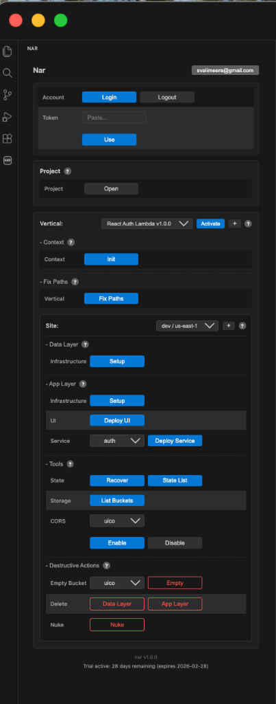

# Nar Actions

Nar Actions is Nar's visual interface for managing your AWS deployments. It lets you provision infrastructure, deploy code, and manage multiple environments without touching the AWS console. Every action available in Nar Actions can also be run via the CLI for scripted or pipeline-based workflows.

## Workflow

The typical deployment flow through Nar Actions:

1. **[Context (Init)](control-panel/init.html)** — One-time setup: create IAM role and state bucket in your AWS account.
2. **[Sites](control-panel/sites.html)** — Create and switch between environments (dev, staging, prod).
3. **[Data Layer](control-panel/data-layer.html)** — Provision S3 storage buckets.
4. **[App Layer](control-panel/app-layer.html)** — Provision compute resources (Lambda, API Gateway, CloudFront) and deploy your code.

## Maintenance

- **[Fix Paths](control-panel/fix-paths.html)** — Update configuration paths after moving your project folder.
- **[Tools](control-panel/tools.html)** — State recovery, resource listing, CORS configuration.
- **[Vertical](control-panel/vertical.html)** — Understand and manage the active vertical.
- **[Destructive Actions](control-panel/destructive-actions.html)** — Delete resources and tear down sites.
