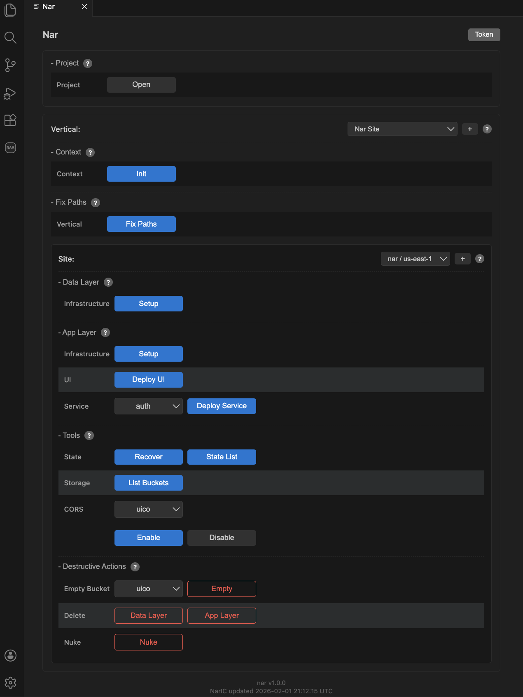

# Nar Actions

Nar Actions is the visual interface for managing your deployments. It lets you provision infrastructure, deploy code, and manage multiple environments — all without touching cloud consoles. Every action available in Nar Actions can also be run via the CLI for scripted or pipeline-based workflows.

## Workflow

The typical deployment flow through Nar Actions:

1. **[Context (Init)](nar-actions/init.html)** — One-time setup: create a role and state storage in your cloud account.
2. **[Sites](nar-actions/sites.html)** — Create and switch between environments (dev, staging, prod).
3. **[Data Layer](nar-actions/data-layer.html)** — Provision storage buckets.
4. **[App Layer](nar-actions/app-layer.html)** — Provision [composites](aws-composites.html) and deploy your code.

## Maintenance

- **[Fix Paths](nar-actions/fix-paths.html)** — Update configuration paths after moving your project folder.
- **[Tools](nar-actions/tools.html)** — State recovery, resource listing, CORS configuration.
- **[Vertical](nar-actions/vertical.html)** — Understand and manage the active vertical.
- **[Destructive Actions](nar-actions/destructive-actions.html)** — Delete resources and tear down sites.
